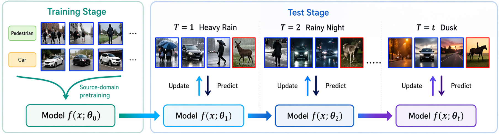

<div align="center">

# Back to Source: Open-Set Continual Test-Time Adaptation via Domain Compensation

[](https://arxiv.org/abs/2604.21772) [](https://cvpr.thecvf.com/)

**Authors:** Yingkai Yang, Chaoqi Chen, Hui Huang

</div>


<p align="center">
  
</p>

> DOCO (**DO**main **CO**mpensation) disentangles domain shift from semantic novelty through back-to-source domain compensation for robust open-set continual test-time adaptation.


---

## 🔥Key Features

- **Comprehensive Evaluation.** We propose an OCTTA evaluation framework that supports 10+ CTTA and OSTTA baselines.
- **Extensible Corruption Pipeline.** We organize synthetic corruption generation pipelines for ImageNet-C and LAION-C, which can be extended to build corrupted versions of additional datasets.
- **Multiple OOD Scoring Functions.** We support multiple OOD scores as measures of distributional abnormality, including MLS, MSP, Entropy, and Energy.
- **Rich Evaluation Metrics.** We support a broad set of metrics to quantify both OOD detection and classification ability, including ACC, AUC, FPR@95, OSCR@FPR95, AUOSCR, and H-score.

---

## ⚙️Requirements

This repository includes two environment files:

- `environment.yml` for quick environment setup
- `environment.lock.yml` for the original environment snapshot

To create the recommended environment, run:

```bash
conda env create -f environment.yml
conda activate doco
```

---

## 🛠️Data Preparation

We use three groups of datasets for the OCTTA benchmarks:

- ID datasets: ImageNet train/val and ImageNet-C.
- OOD datasets: Places365, Textures, iNaturalist, SUN, NINCO, and SSB-Hard.
- Generated corrupted OOD/ID variants: OOD-C for the ImageNet-C benchmark, and ImageNet-L/OOD-L for the LAION-C benchmark.

Before running the preparation or evaluation scripts, set your local dataset root. The released scripts use `/mnt/d/stamp_lib/datasets` by default, and also honor the `DATA_ROOT` environment variable:

```bash
export DATA_ROOT=/path/to/your/datasets
```

### 1. Download the Original Datasets

Download the ImageNet ILSVRC2012 training and validation sets:

- ImageNet train: [`ILSVRC2012_img_train.tar`](https://image-net.org/data/ILSVRC/2012/ILSVRC2012_img_train.tar)
- ImageNet val: [`ILSVRC2012_img_val.tar`](https://image-net.org/data/ILSVRC/2012/ILSVRC2012_img_val.tar)
- ImageNet devkit: [`ILSVRC2012_devkit_t12.tar.gz`](https://image-net.org/data/ILSVRC/2012/ILSVRC2012_devkit_t12.tar.gz)

After extracting ImageNet val, organize the validation images into class folders. One useful reference is [this ImageNet validation-folder preparation note](https://zhuanlan.zhihu.com/p/654411008).

Download ImageNet-C from the official Zenodo release:

- ImageNet-C: <https://zenodo.org/records/2235448#.Yj2RO_co_mF>

Download the six original OOD datasets:

- Places365: <https://aistudio.baidu.com/datasetdetail/219760>  Download `val_256.tar` only.
- Textures / DTD: <https://www.robots.ox.ac.uk/~vgg/data/dtd/>
- iNaturalist: <http://pages.cs.wisc.edu/~huangrui/imagenet_ood_dataset/iNaturalist.tar.gz>
- SUN: <http://pages.cs.wisc.edu/~huangrui/imagenet_ood_dataset/SUN.tar.gz>
- NINCO and SSB-Hard: <https://drive.google.com/drive/folders/1IFb4pPWTHsvWV6ezzbmGkIR64_VnOdSh>

The iNaturalist and SUN links are from [MOS](https://github.com/deeplearning-wisc/large_scale_ood). The NINCO and SSB-Hard link is from [COME](https://github.com/BlueWhaleLab/COME).

Download the additional ImageNet variants used in the closed-set benchmark:

- ImageNet-A: <https://people.eecs.berkeley.edu/~hendrycks/imagenet-a.tar>
- ImageNet-R: <https://people.eecs.berkeley.edu/~hendrycks/imagenet-r.tar>
- ImageNet-Sketch: <https://drive.google.com/open?id=1Mj0i5HBthqH1p_yeXzsg22gZduvgoNeA>

A typical directory layout is:

```text
<DATA_ROOT>/
  ImageNet/
    train/
    val/
      n01440764/
      n01443537/
      ...
  ImageNet-C/
  ImageNet-A/
    imagenet-a/
  ImageNet-R/
    imagenet-r/
  ImageNet-Sketch/
    sketch/
  PLACES365/
    val_256/
  Textures/
    images/
  iNaturalist/
    images/
  SUN/
    images/
  NINCO/
    NINCO_OOD_classes/
  SSB-Hard/
```

### 2. Generate OOD-C for the ImageNet-C Benchmark

The ImageNet-C benchmark uses the original OOD datasets to generate the corresponding OOD-C datasets: Places365-C / Textures-C / iNaturalist-C / SUN-C / NINCO_OOD-C / SSB-Hard-C.
This distortion pipeline is modified from <https://github.com/yuyongcan/generating_outlier>.

First, make sure the six datasets are enabled in `make_C_corruption/corruption_data_preparation.py`:

```python
DATASETS_TO_PROCESS = [
    'places365',
    'inaturalist',
    'sun',
    'textures',
    'ssb-hard',
    'ninco_ood_classes',
]
```

Then run:

```bash
cd make_C_corruption
python corruption_data_preparation.py
```

By default, the generated datasets are saved under `<DATA_ROOT>` as `PLACES365-C`, `Textures-C`, `iNaturalist-C`, `SUN-C`, `NINCO_OOD_classes-C`, and `SSB-Hard-C`. The script supports resume-by-skipping: if an output image already exists, it will be skipped automatically.

The generated OOD-C layout expected by the evaluator is:

```text
<DATA_ROOT>/
  PLACES365-C/<corruption>/5/val_256/*.jpg
  iNaturalist-C/<corruption>/5/images/*.jpg
  SUN-C/<corruption>/5/images/*.jpg
  Textures-C/<corruption>/5/images/<class>/*.jpg
  NINCO_OOD_classes-C/<corruption>/5/images/<class>/*.jpg
  SSB-Hard-C/<corruption>/5/images/<class>/*.jpg
```

### 3. Generate ID-L and OOD-L for the LAION-C Benchmark

The LAION-C OCTTA benchmark requires two generated dataset groups:

1. ImageNet-L, generated from the original ImageNet validation set.
2. OOD-L, generated from the six original OOD datasets: Places365-L, Textures-L, iNaturalist-L, SUN-L, NINCO-L, and SSB-Hard-L.

This distortion pipeline is modified from <https://github.com/FanfeiLi/LAION-C>.

The `mosaic` and `sticker` corruptions require a WebDataset tile archive. Create it first from ImageNet val:

```bash
cd make_L_corruption
python prerun_create_webdataset.py
```

This creates `imagenet_val_tiles.tar` under `$DATA_ROOT`. The ImageNet-L script reads the 5k ImageNet validation subset list from `imagenet/robustbench/data/imagenet_test_image_ids_5k.txt`.

Next, generate ImageNet-L:

```bash
python run_laionc_synthetic_ImageNet.py
```

Finally, generate the six OOD-L datasets:

```bash
python run_laionc_synthetic_sixOOD.py
```

By default, these scripts generate `ImageNet-LAION-5K` for ID-L and `Places365-L-6k`, `Textures-L-6k`, `iNaturalist-L-6k`, `SUN-L-6k`, `NINCO_OOD_classes-L-6k`, and `SSB-Hard-L-6k` for OOD-L. The scripts also support resume-by-skipping existing valid outputs.

The generated LAION-C layout expected by the evaluator is:

```text
<DATA_ROOT>/
  ImageNet-LAION-5K/<corruption>/intensity_level_<1-or-3>/<class>/*.JPEG
  Places365-L-6k/<corruption>/intensity_level_<1-or-3>/*.JPEG
  iNaturalist-L-6k/<corruption>/intensity_level_<1-or-3>/*.JPEG
  SUN-L-6k/<corruption>/intensity_level_<1-or-3>/*.JPEG
  Textures-L-6k/<corruption>/intensity_level_<1-or-3>/<class>/*.JPEG
  NINCO_OOD_classes-L-6k/<corruption>/intensity_level_<1-or-3>/<class>/*.JPEG
  SSB-Hard-L-6k/<corruption>/intensity_level_<1-or-3>/<class>/*.JPEG
```

---

## 🚀 Running Experiments

Before launching experiments, set `DATA_ROOT` if your datasets are not under `/mnt/d/stamp_lib/datasets`, and check the remaining runtime variables in each script, such as `CONDA_ENV_NAME`, `CUDA_DEVICE_ID`, and `SAVE_DIR_BASE`.

### 1. ImageNet-C Benchmark

Use [`imgnetcXratio_octta.sh`](imgnetcXratio_octta.sh) to run the ImageNet-C OCTTA benchmark.

Select the methods and OOD datasets by commenting or uncommenting entries in:

```bash
METHODS=(...)
OOD_DATASETS=(...)
```

The benchmark supports five OOD-ratio settings: `10%`, `20%`, `30%`, `40%`, and `50%`. Select the desired ratios by editing:

```bash
OOD_PROPORTIONS=(...)
```

Run the benchmark with:

```bash
bash imgnetcXratio_octta.sh
```

### 2. LAION-C Benchmark

Use [`laioncXseverity_octta.sh`](laioncXseverity_octta.sh) to run the LAION-C OCTTA benchmark.

Select the methods and OOD datasets by commenting or uncommenting entries in:

```bash
METHODS=(...)
OOD_DATASETS=(...)
```

The benchmark supports two domain-shift severity levels: `1` and `3`. Select the desired severity levels by editing:

```bash
SEVERITIES=(...)
```

Run the benchmark with:

```bash
bash laioncXseverity_octta.sh
```

### 3. Closed-Set TTA & CTTA Benchmark

Use [`closed_imgnetCLASR.sh`](closed_imgnetCLASR.sh) to run the closed-set benchmark.

Select the methods by commenting or uncommenting entries in:

```bash
METHODS=(...)
```

The script supports five closed-set datasets:

```bash
DATASETS=(
    "imagenet-c"
    "laion-c"
    "imagenet-a"
    "imagenet-sketch"
    "imagenet-r"
)
```

Run the benchmark with:

```bash
bash closed_imgnetCLASR.sh
```

---

## 📌Citation

If you find this project useful in your research, please consider citing our paper:

```bibtex
@inproceedings{yang2026backtosource,
  title={Back to Source: Open-Set Continual Test-Time Adaptation via Domain Compensation},
  author={Yang, Yingkai and Chen, Chaoqi and Huang, Hui},
  booktitle={Proceedings of the IEEE/CVF Conference on Computer Vision and Pattern Recognition},
  year={2026}
}
```
---

## 🎈Acknowledgments

This work heavily utilized code and concepts from the following excellent projects:

- [LAION-C](https://github.com/FanfeiLi/LAION-C)
- [STAMP](https://github.com/yuyongcan/STAMP)
- [DPCore](https://github.com/yunbeizhang/DPCore)
- [COME](https://github.com/BlueWhaleLab/COME)
- [UniEnt](https://github.com/gaozhengqing/UniEnt)
- [RobustBench](https://github.com/RobustBench/robustbench)

We thank the authors for making their work publicly available.
